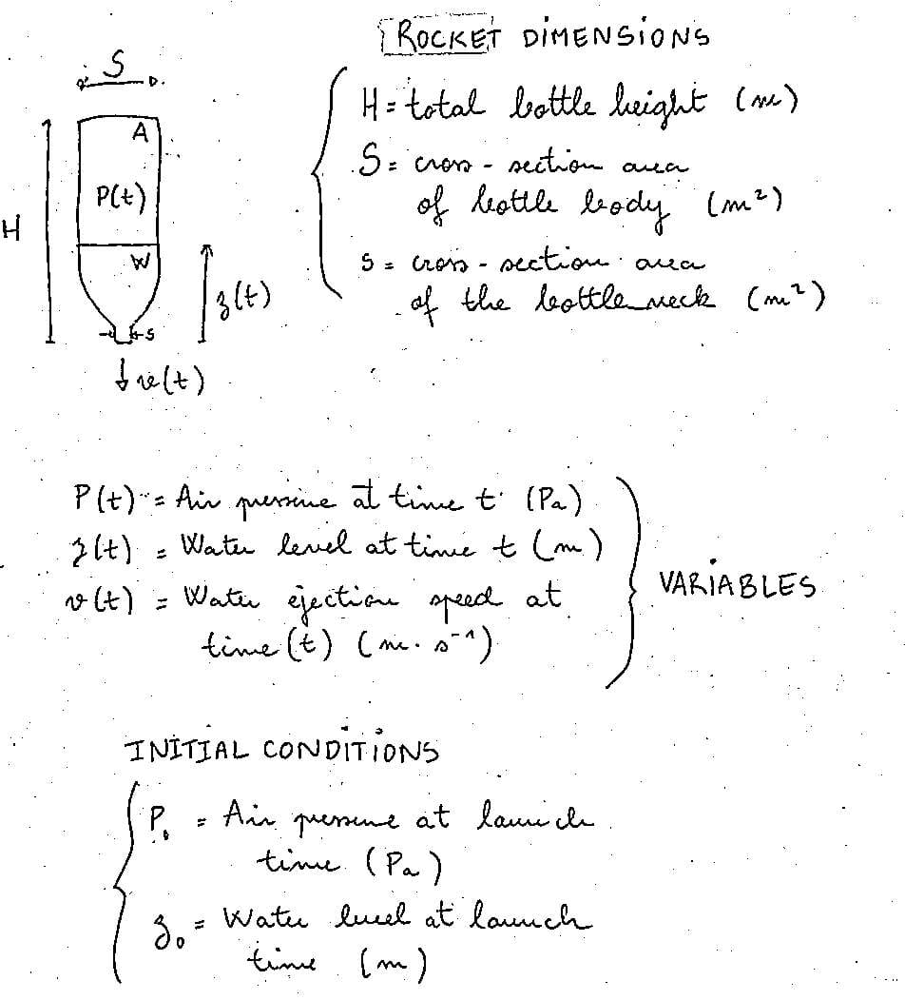

# WaterRocket

Little physics code for my courses. The point is to simulate the reaction speed of a water jet at the bottom of a water rocket.  

Bernoulli's theorem associated with conservation of mass allows the following relations between v, z, and p:

$$\begin{align*}
p(t)&= \frac{p_0 (H - z_0)}{H-z(t)}\\
v(t)&= \frac{dz}{dt}\frac{S}{s}\\
p(t)&-p_a + \frac{1}{2} \rho \left( (\frac{dz}{dt})^2 - v^2) \right) + \rho g z = 0
\end{align*}$$

Which yields the following non-linear ODE on z: $(\frac{dz}{dt})^2(\frac{S^2}{s^2}-1) = \frac{2}{\rho}(p(t)-p_a) + 2gz$

and ultimately (we have to take the negative value here because the water level is decreasing as the tank empties):

$$\frac{dz}{dt} = - \sqrt{\frac{2}{\beta}\frac{p(z(t))-p_a}{\rho} + 2gz(t)} = F(t,z(t))$$  

where $\beta = (\frac{S^2}{s^2}-1)$. We can then use explicit Euler's method to solve this ODE with any starting parameters:

$$z_{n+1}=z_n + \Delta t \ F(t_n, z_n)$$