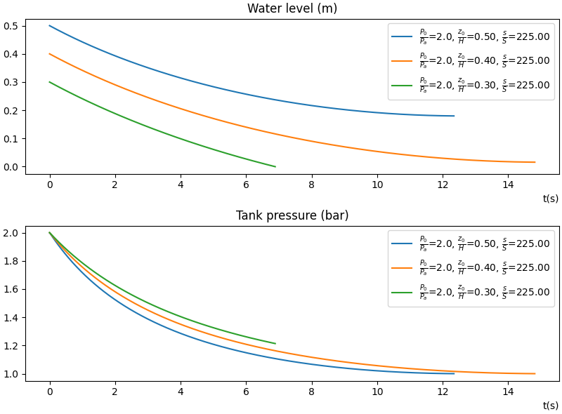

# WaterRocket

Simulation of the emptying speed of a water tank when put under pressure. The water jet at the bottom can be used as propulsion to make a water rocket.  

We make the following assumptions :

$$\begin{align*} 
v(t) &\ll |\frac{dz}{dt}| \\
\rho g z(t) &\ll p(t)-p_a
\end{align*}$$

Under these hypotheses Bernoulli's theorem, conservation of mass flow and adiabatic expansion yield the following relations between $v$, $z$, and $p$:

$$\begin{align*}
p(t) -& p_a + \frac{1}{2} \rho v^2= 0 \\
v(t)&= -\frac{S}{s}\frac{dz}{dt} = - \frac{1}{\beta}\frac{dz}{dt}\\
p(t)&= p_0 \left( \frac{H-z_0}{H-z} \right)^\gamma\\
\end{align*}$$

Which yields the following non-linear ODE on z:

$$\frac{dz}{dt} = - \beta \sqrt{\frac{2}{\rho} (p_0 \left( \frac{H-z_0}{H-z} \right)^\gamma - p_a)} = F(z)$$

We can then use explicit Euler's method to solve this ODE with any starting parameters:

$$z_{n+1}=z_n + \Delta t \ F(z_n)$$

## Results

For a given set of inital conditions and tank dimensions, $z_n$ is computed until one of these 2 conditions are met:

1. The water level has reached the bottom of the tank
2. The water level speed comes close to zero (meaning hydrostatic equilibrium is reached)

If the term $\frac{p(z_n)-p_a}{\rho} + gz_n$ becomes negative, then that means the water level is passing under hydrostatic equilibrium, which is physically impossible. When this happens the simulation is stopped and the user is informed that the time step should be reduced to ensure physical consistency.

### Impact of the initial water height in tank

The figure above shows the water level and ejection speed over the time of the simulation for a starting pressure of 2 bars and three different initial water levels. When the starting water height is half the tank's height, then the tank fully empties as the tank pressure reaches atmospheric pressure. If we increase the water level, the pressures balance out before the tank is emptied. On the other hand, a less full water tank gets emptied faster, and keeps a higher internal pressure up to the end.

### Impact of inital air pressure on thrust and impulse

In this section we study the real-life rocket : a Coke bottle of $D=9cm$ and $d=10mm$, starting with $z_0=\frac{1}{3}H$.

The overall thrust that is produced by the water ejection is plotted above for different initial pressures of the rocket body. The impulse here is computed for the jet reaction alone, ignoring the impact of the weight on the rocket's dynamics.